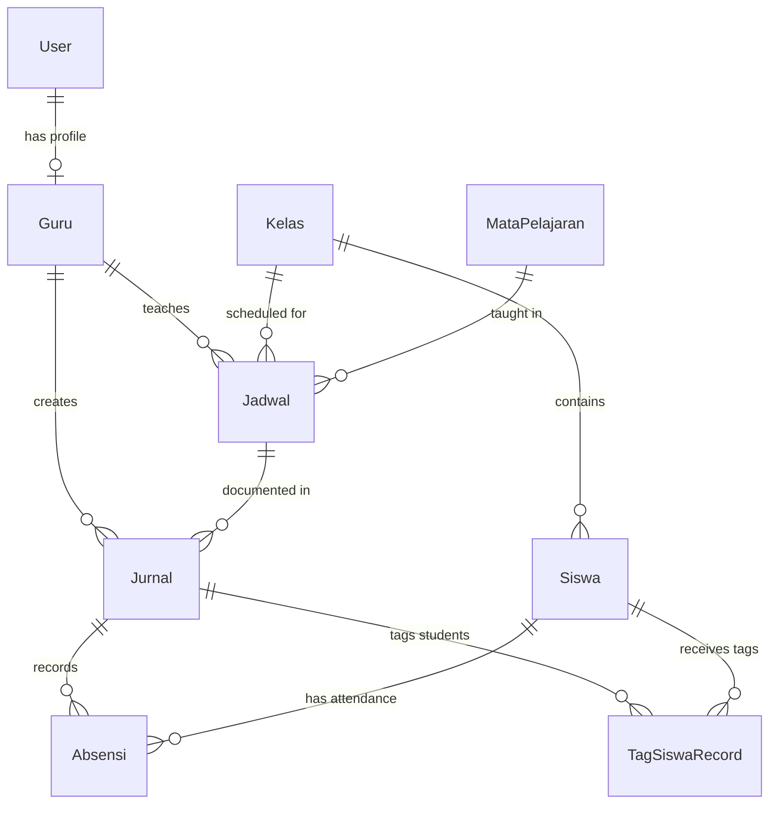

# Design Document - Aplikasi Jurnal Mengajar Modern

## Overview

Aplikasi Jurnal Mengajar Modern adalah aplikasi web full-stack yang dibangun dengan Next.js 14+ menggunakan App Router. Aplikasi ini menggunakan arsitektur monolitik dengan pemisahan yang jelas antara layer presentasi, business logic, dan data access. Autentikasi dikelola menggunakan NextAuth.js, data disimpan di PostgreSQL, dan akses database melalui Prisma ORM. UI dibangun dengan Tailwind CSS untuk styling yang konsisten dan responsif.

## Architecture

### High-Level Architecture

```
┌─────────────────────────────────────────────────────────────┐
│                        Client Browser                        │
│                     (React Components)                       │
└──────────────────────┬──────────────────────────────────────┘
                       │
                       │ HTTP/HTTPS
                       │
┌──────────────────────▼──────────────────────────────────────┐
│                    Next.js App Router                        │
│  ┌────────────────────────────────────────────────────────┐ │
│  │              Pages & Route Handlers                    │ │
│  │  - /app/(auth)/login                                   │ │
│  │  - /app/(guru)/dashboard                               │ │
│  │  - /app/(guru)/jurnal/[id]                            │ │
│  │  - /app/(guru)/analitik                               │ │
│  │  - /app/(admin)/dashboard                             │ │
│  │  - /app/api/auth/[...nextauth]                        │ │
│  │  - /app/api/jurnal/*                                  │ │
│  │  - /app/api/master/*                                  │ │
│  └────────────────────────────────────────────────────────┘ │
│  ┌────────────────────────────────────────────────────────┐ │
│  │              Server Actions & Services                 │ │
│  │  - Authentication Service                              │ │
│  │  - Jurnal Service                                      │ │
│  │  - Master Data Service                                 │ │
│  │  - Analytics Service                                   │ │
│  └────────────────────────────────────────────────────────┘ │
└──────────────────────┬──────────────────────────────────────┘
                       │
                       │ Prisma Client
                       │
┌──────────────────────▼──────────────────────────────────────┐
│                   PostgreSQL Database                        │
│  - Users (Guru, Admin)                                       │
│  - Master Data (Kelas, Mapel, Siswa, Jadwal)               │
│  - Jurnal Mengajar                                          │
│  - Absensi                                                  │
│  - Tag Siswa                                                │
└─────────────────────────────────────────────────────────────┘
```

### Technology Stack

- **Frontend**: Next.js 14+ (App Router), React 18+, Tailwind CSS
- **Backend**: Next.js API Routes & Server Actions
- **Authentication**: NextAuth.js v5 (Auth.js)
- **Database**: PostgreSQL 14+
- **ORM**: Prisma 5+
- **Validation**: Zod
- **State Management**: React Server Components + Client Components (minimal client state)
- **File Upload**: (Optional) Next.js API Routes untuk handle URL validation

## Components and Interfaces

### 1. Authentication Layer

#### NextAuth Configuration
```typescript
// /lib/auth.ts
import NextAuth from "next-auth"
import CredentialsProvider from "next-auth/providers/credentials"

export const authOptions = {
  providers: [
    CredentialsProvider({
      credentials: {
        username: { type: "text" },
        password: { type: "password" }
      },
      authorize: async (credentials) => {
        // Validate against database
        // Return user object with role
      }
    })
  ],
  callbacks: {
    jwt: ({ token, user }) => {
      // Add role to token
    },
    session: ({ session, token }) => {
      // Add role to session
    }
  }
}
```

#### Middleware untuk Route Protection
```typescript
// /middleware.ts
export function middleware(request: NextRequest) {
  // Check authentication
  // Redirect based on role (guru/admin)
}
```

### 2. Page Components

#### Dashboard Guru (`/app/(guru)/dashboard/page.tsx`)
- Server Component yang fetch jadwal hari ini
- Menampilkan list jadwal dengan status (terisi/belum)
- Button untuk navigasi ke form jurnal

#### Form Jurnal (`/app/(guru)/jurnal/[jadwalId]/page.tsx`)
- Client Component untuk interaktivitas
- Pre-filled data dari jadwal
- Form sections: Info Sesi, Detail Pembelajaran, Absensi, Catatan
- Smart checklist untuk absensi
- Tag siswa modal
- Link bukti pembelajaran (optional)

#### Analitik Personal (`/app/(guru)/analitik/page.tsx`)
- Server Component dengan data aggregation
- Cards untuk: Keterlaksanaan TP, Absensi Siswa, Tindak Lanjut
- Charts menggunakan library seperti Recharts atau Chart.js

#### Dashboard Admin (`/app/(admin)/dashboard/page.tsx`)
- Server Component dengan overview metrics
- Links ke management pages dan reports

#### Master Data Management (`/app/(admin)/master/[entity]/page.tsx`)
- CRUD interface untuk setiap entity (guru, kelas, mapel, siswa, jadwal)
- Table dengan pagination
- Modal/drawer untuk add/edit forms

### 3. Reusable UI Components

```
/components
  /ui
    - button.tsx
    - input.tsx
    - textarea.tsx
    - select.tsx
    - card.tsx
    - table.tsx
    - modal.tsx
    - badge.tsx
  /forms
    - jurnal-form.tsx
    - absensi-checklist.tsx
    - tag-siswa-modal.tsx
  /dashboard
    - jadwal-card.tsx
    - stat-card.tsx
    - chart-wrapper.tsx
```

### 4. Server Actions & Services

#### Jurnal Service (`/lib/services/jurnal.service.ts`)
```typescript
export class JurnalService {
  async createJurnal(data: CreateJurnalDTO): Promise<Jurnal>
  async getJurnalByJadwal(jadwalId: string): Promise<Jurnal | null>
  async getJurnalByGuru(guruId: string, filters: FilterDTO): Promise<Jurnal[]>
  async updateJurnal(id: string, data: UpdateJurnalDTO): Promise<Jurnal>
}
```

#### Master Data Service (`/lib/services/master.service.ts`)
```typescript
export class MasterService {
  async getGuru(): Promise<Guru[]>
  async createGuru(data: CreateGuruDTO): Promise<Guru>
  async getKelas(): Promise<Kelas[]>
  async getSiswaByKelas(kelasId: string): Promise<Siswa[]>
  async getJadwalByGuruAndDate(guruId: string, date: Date): Promise<Jadwal[]>
  // ... CRUD methods for all master entities
}
```

#### Analytics Service (`/lib/services/analytics.service.ts`)
```typescript
export class AnalyticsService {
  async getKeterlaksanaanTP(guruId: string): Promise<KeterlaksanaanStats>
  async getAbsensiAnalytics(guruId: string, days: number): Promise<AbsensiStats>
  async getTindakLanjutStats(guruId: string): Promise<TindakLanjutStats>
  async getKeterisisanJurnal(filters: FilterDTO): Promise<KeterisisanReport>
  async getAggregateAbsensi(filters: FilterDTO): Promise<AbsensiReport>
}
```

## Data Models

### Prisma Schema (`/prisma/schema.prisma`)

```prisma
generator client {
  provider = "prisma-client-js"
}

datasource db {
  provider = "postgresql"
  url      = env("DATABASE_URL")
}

enum Role {
  GURU
  ADMIN
}

enum StatusAbsensi {
  HADIR
  SAKIT
  IZIN
  ALPA
}

enum TagSiswa {
  PERLU_REMEDIAL
  PERLU_PENGAYAAN
  MASALAH_PERILAKU
  RUJUK_BK
}

model User {
  id        String   @id @default(cuid())
  username  String   @unique
  password  String   // hashed
  nama      String
  role      Role
  email     String?
  createdAt DateTime @default(now())
  updatedAt DateTime @updatedAt
  
  // Relations
  guruProfile Guru?
  
  @@map("users")
}

model Guru {
  id        String   @id @default(cuid())
  userId    String   @unique
  nip       String?  @unique
  
  // Relations
  user      User     @relation(fields: [userId], references: [id], onDelete: Cascade)
  jadwal    Jadwal[]
  jurnal    Jurnal[]
  
  @@map("guru")
}

model Kelas {
  id        String   @id @default(cuid())
  nama      String   @unique // "10-A", "11-IPA-1"
  tingkat   Int      // 10, 11, 12
  jurusan   String?  // "IPA", "IPS", "Umum"
  createdAt DateTime @default(now())
  updatedAt DateTime @updatedAt
  
  // Relations
  siswa     Siswa[]
  jadwal    Jadwal[]
  
  @@map("kelas")
}

model MataPelajaran {
  id        String   @id @default(cuid())
  nama      String   @unique
  kode      String?  @unique
  createdAt DateTime @default(now())
  updatedAt DateTime @updatedAt
  
  // Relations
  jadwal    Jadwal[]
  
  @@map("mata_pelajaran")
}

model Siswa {
  id        String   @id @default(cuid())
  nisn      String   @unique
  nama      String
  kelasId   String
  jenisKelamin String?
  createdAt DateTime @default(now())
  updatedAt DateTime @updatedAt
  
  // Relations
  kelas     Kelas    @relation(fields: [kelasId], references: [id], onDelete: Cascade)
  absensi   Absensi[]
  tagSiswa  TagSiswaRecord[]
  
  @@map("siswa")
}

model Jadwal {
  id            String   @id @default(cuid())
  guruId        String
  kelasId       String
  mataPelajaranId String
  hari          Int      // 0=Minggu, 1=Senin, ..., 6=Sabtu
  jamMulai      String   // "07:30"
  jamSelesai    String   // "09:00"
  semester      Int      // 1 atau 2
  tahunAjaran   String   // "2024/2025"
  createdAt     DateTime @default(now())
  updatedAt     DateTime @updatedAt
  
  // Relations
  guru          Guru     @relation(fields: [guruId], references: [id], onDelete: Cascade)
  kelas         Kelas    @relation(fields: [kelasId], references: [id], onDelete: Cascade)
  mataPelajaran MataPelajaran @relation(fields: [mataPelajaranId], references: [id], onDelete: Cascade)
  jurnal        Jurnal[]
  
  @@unique([guruId, kelasId, mataPelajaranId, hari, jamMulai, semester, tahunAjaran])
  @@map("jadwal")
}

model Jurnal {
  id                  String   @id @default(cuid())
  jadwalId            String
  guruId              String
  tanggal             DateTime @db.Date
  
  // Detail Pembelajaran
  tujuanPembelajaran  String   @db.Text
  kegiatanPembelajaran String  @db.Text
  asesmen             String?  @db.Text
  
  // Catatan & Tindak Lanjut
  catatanKhusus       String?  @db.Text
  linkBukti           String?  // URL to Google Drive, etc.
  
  createdAt           DateTime @default(now())
  updatedAt           DateTime @updatedAt
  
  // Relations
  jadwal              Jadwal   @relation(fields: [jadwalId], references: [id], onDelete: Cascade)
  guru                Guru     @relation(fields: [guruId], references: [id], onDelete: Cascade)
  absensi             Absensi[]
  tagSiswa            TagSiswaRecord[]
  
  @@unique([jadwalId, tanggal])
  @@index([guruId, tanggal])
  @@map("jurnal")
}

model Absensi {
  id        String        @id @default(cuid())
  jurnalId  String
  siswaId   String
  status    StatusAbsensi @default(HADIR)
  createdAt DateTime      @default(now())
  updatedAt DateTime      @updatedAt
  
  // Relations
  jurnal    Jurnal        @relation(fields: [jurnalId], references: [id], onDelete: Cascade)
  siswa     Siswa         @relation(fields: [siswaId], references: [id], onDelete: Cascade)
  
  @@unique([jurnalId, siswaId])
  @@index([siswaId, status])
  @@map("absensi")
}

model TagSiswaRecord {
  id        String    @id @default(cuid())
  jurnalId  String
  siswaId   String
  tag       TagSiswa
  keterangan String?  @db.Text
  ditindaklanjuti Boolean @default(false)
  createdAt DateTime  @default(now())
  updatedAt DateTime  @updatedAt
  
  // Relations
  jurnal    Jurnal    @relation(fields: [jurnalId], references: [id], onDelete: Cascade)
  siswa     Siswa     @relation(fields: [siswaId], references: [id], onDelete: Cascade)
  
  @@index([siswaId, tag, ditindaklanjuti])
  @@map("tag_siswa_record")
}
```

### Database Relationships



## API Routes & Server Actions

### Authentication Routes
- `POST /api/auth/signin` - Login (handled by NextAuth)
- `POST /api/auth/signout` - Logout (handled by NextAuth)
- `GET /api/auth/session` - Get current session (handled by NextAuth)

### Jurnal Routes (Server Actions preferred)
```typescript
// /app/actions/jurnal.ts
'use server'

export async function createJurnal(data: FormData)
export async function getJadwalHariIni(guruId: string)
export async function getJurnalById(id: string)
export async function updateJurnal(id: string, data: FormData)
```

### Master Data Routes (Server Actions)
```typescript
// /app/actions/master.ts
'use server'

export async function getKelas()
export async function createKelas(data: FormData)
export async function getSiswaByKelas(kelasId: string)
export async function getJadwal(filters: FilterDTO)
// ... other CRUD operations
```

### Analytics Routes (Server Actions)
```typescript
// /app/actions/analytics.ts
'use server'

export async function getAnalyticsGuru(guruId: string)
export async function getKeterisisanJurnal(filters: FilterDTO)
export async function getAggregateAbsensi(filters: FilterDTO)
```

## User Interface Design

### Design System (Tailwind Configuration)

```javascript
// tailwind.config.js
module.exports = {
  theme: {
    extend: {
      colors: {
        primary: {
          50: '#eff6ff',
          500: '#3b82f6',
          600: '#2563eb',
          700: '#1d4ed8',
        },
        success: '#10b981',
        warning: '#f59e0b',
        danger: '#ef4444',
      }
    }
  }
}
```

### Key UI Patterns

#### 1. Dashboard Guru - Jadwal Card
```
┌─────────────────────────────────────────┐
│ 07:30 - 09:00                    [✓]    │
│ Matematika • Kelas 10-A                 │
│                                         │
│ [Isi Jurnal] atau [✅ Terisi]          │
└─────────────────────────────────────────┘
```

#### 2. Form Jurnal - Smart Checklist Absensi
```
┌─────────────────────────────────────────┐
│ Absensi Siswa                           │
│ ─────────────────────────────────────── │
│ ☑ Ahmad Fauzi                  [Hadir]  │
│ ☑ Budi Santoso                 [Hadir]  │
│ ☐ Citra Dewi          [Sakit|Izin|Alpa] │ ← Tap to change
│ ☑ Dina Marlina                 [Hadir]  │
│                                         │
│ Rekap: Hadir: 30 | Sakit: 1 | Alpa: 0  │
└─────────────────────────────────────────┘
```

#### 3. Tag Siswa Modal
```
┌─────────────────────────────────────────┐
│ Tandai Siswa                      [×]   │
│ ─────────────────────────────────────── │
│ Pilih Siswa:                            │
│ [Dropdown: Citra Dewi]                  │
│                                         │
│ Pilih Tag:                              │
│ ○ Perlu Remedial                        │
│ ○ Perlu Pengayaan                       │
│ ○ Masalah Perilaku                      │
│ ○ Rujuk ke BK                           │
│                                         │
│ Keterangan (opsional):                  │
│ [Text area...]                          │
│                                         │
│           [Batal]  [Simpan]             │
└─────────────────────────────────────────┘
```

## Error Handling

### Client-Side Validation
- Form validation menggunakan Zod schema
- Real-time validation feedback
- Error messages yang jelas dan actionable

### Server-Side Error Handling
```typescript
// /lib/errors.ts
export class AppError extends Error {
  constructor(
    public statusCode: number,
    public message: string,
    public isOperational = true
  ) {
    super(message)
  }
}

export class ValidationError extends AppError {
  constructor(message: string) {
    super(400, message)
  }
}

export class NotFoundError extends AppError {
  constructor(resource: string) {
    super(404, `${resource} not found`)
  }
}

export class UnauthorizedError extends AppError {
  constructor() {
    super(401, 'Unauthorized access')
  }
}
```

### Error Boundary
```typescript
// /app/error.tsx
'use client'

export default function Error({
  error,
  reset,
}: {
  error: Error & { digest?: string }
  reset: () => void
}) {
  return (
    <div>
      <h2>Something went wrong!</h2>
      <button onClick={() => reset()}>Try again</button>
    </div>
  )
}
```

## Testing Strategy

### Unit Testing
- Test utility functions dan helper methods
- Test validation schemas (Zod)
- Test service layer methods dengan mocked Prisma client
- Framework: Jest atau Vitest

### Integration Testing
- Test API routes dan Server Actions
- Test database operations dengan test database
- Test authentication flow
- Framework: Jest + Supertest atau Vitest

### E2E Testing (Optional)
- Test critical user flows:
  - Login sebagai Guru
  - Mengisi jurnal lengkap
  - Melihat analitik
  - Admin mengelola data master
- Framework: Playwright atau Cypress

### Testing Approach
1. Write tests for critical business logic first
2. Focus on happy path and common error scenarios
3. Mock external dependencies (database, auth)
4. Use test fixtures for consistent test data

## Security Considerations

### Authentication & Authorization
- Password hashing menggunakan bcrypt
- Session management via NextAuth
- Role-based access control (RBAC)
- Middleware untuk route protection

### Data Validation
- Input validation di client dan server
- SQL injection prevention via Prisma (parameterized queries)
- XSS prevention via React's built-in escaping

### API Security
- CSRF protection (NextAuth built-in)
- Rate limiting untuk API routes (optional: menggunakan middleware)
- Secure headers (Next.js security headers)

## Performance Optimization

### Database Optimization
- Proper indexing pada foreign keys dan frequently queried fields
- Use of `@@index` dan `@@unique` di Prisma schema
- Connection pooling via Prisma

### Caching Strategy
- Server Component caching (Next.js automatic)
- Revalidation strategy untuk data yang jarang berubah
- Client-side caching untuk master data (React Query optional)

### Code Splitting
- Automatic code splitting via Next.js App Router
- Dynamic imports untuk heavy components (charts, modals)

### Image Optimization
- Next.js Image component untuk optimized images (jika ada foto profil, dll)

## Deployment Considerations

### Environment Variables
```env
DATABASE_URL="postgresql://..."
NEXTAUTH_URL="http://localhost:3000"
NEXTAUTH_SECRET="..."
```

### Database Migration
```bash
# Development
npx prisma migrate dev

# Production
npx prisma migrate deploy
```

### Build & Deploy
```bash
# Build
npm run build

# Start production server
npm run start
```

### Hosting Recommendations
- **Vercel**: Optimal untuk Next.js (zero-config)
- **Railway/Render**: Untuk PostgreSQL database
- **Alternative**: VPS (DigitalOcean, AWS EC2) dengan Docker

## Future Enhancements

1. **Export/Import Data**: Export jurnal ke Excel/PDF
2. **Notifikasi**: Email/push notification untuk reminder mengisi jurnal
3. **Mobile App**: React Native atau PWA untuk akses mobile
4. **Backup Otomatis**: Scheduled backup database
5. **Multi-tenant**: Support untuk multiple sekolah dalam satu instance
6. **Integrasi**: API untuk integrasi dengan sistem lain (SIAKAD, dll)
